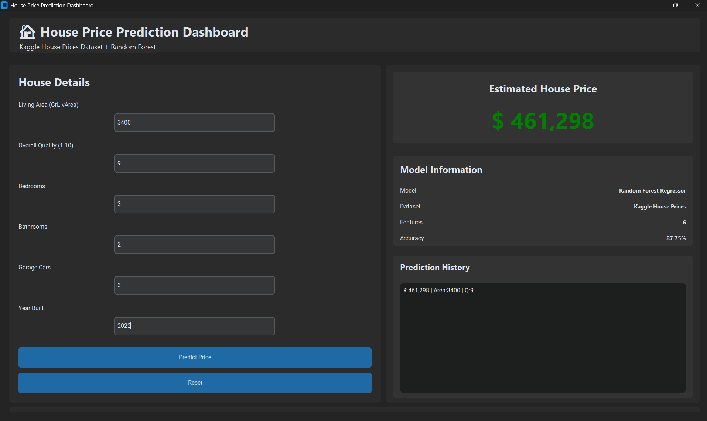

# 🏠 House Price Prediction Dashboard

A Machine Learning-powered desktop application that predicts house prices using real-world housing data from the Kaggle House Prices Dataset. The project uses a Random Forest Regressor model and provides predictions through a modern graphical user interface built with CustomTkinter.

---

## 📸 Dashboard Preview



---

## 📖 Project Overview

The House Price Prediction Dashboard is designed to estimate the selling price of a house based on important property characteristics. The application uses Machine Learning techniques to analyze housing features and predict the expected market value of a property.

This project demonstrates the practical implementation of:

* Machine Learning
* Regression Analysis
* Data Preprocessing
* Model Evaluation
* Desktop Application Development
* Python GUI Programming

---

## 🎯 Features

✅ Modern Dark-Themed Dashboard

✅ Real-Time House Price Prediction

✅ Random Forest Regression Model

✅ Model Accuracy Display

✅ Prediction History Tracking

✅ Input Validation

✅ Professional User Interface

✅ Trained on Real Kaggle Housing Dataset

---

## 🛠️ Technologies Used

### Programming Language

* Python 3

### Libraries

* Pandas
* NumPy
* Scikit-Learn
* Joblib
* CustomTkinter

### Machine Learning Algorithm

* Random Forest Regressor

### Development Environment

* Visual Studio Code

---

## 📊 Dataset

This project uses the Kaggle House Prices Dataset.

Dataset Features Used:

| Feature      | Description                                |
| ------------ | ------------------------------------------ |
| GrLivArea    | Above-ground living area (square feet)     |
| OverallQual  | Overall material and finish quality (1–10) |
| BedroomAbvGr | Number of bedrooms above ground            |
| FullBath     | Number of full bathrooms                   |
| GarageCars   | Garage capacity (number of cars)           |
| YearBuilt    | Year the property was built                |

### Target Variable

| Variable  | Description            |
| --------- | ---------------------- |
| SalePrice | House Sale Price (USD) |

---

🤖 Machine Learning Model

The application uses a **Random Forest Regressor** to predict house prices.

Why Random Forest?

* Handles non-linear relationships effectively
* Reduces overfitting
* Provides strong prediction performance
* Works well with structured tabular data

---

## 📈 Model Performance

### Evaluation Metric

**R² Score (Coefficient of Determination)**

### Achieved Accuracy

**87.75%**

This indicates that the model explains approximately 87.75% of the variation in house prices using the selected features.

---

🖥️ Application Interface

The dashboard consists of:

House Details Panel

Users can enter:

* Living Area
* Overall Quality
* Bedrooms
* Bathrooms
* Garage Capacity
* Year Built

Prediction Panel

Displays:

* Predicted House Price
* Model Information
* Dataset Information
* Accuracy Score

Prediction History

Stores previous predictions during the current application session.

---

📂 Project Structure

```text
HousepricePrediction
│
├── assets
│   └── dashboard.png
│
├── dataset
│   ├── train.csv
│   ├── test.csv
│   └── data_description.txt
│
├── models
│   └── .gitkeep
│
├── app.py
├── train_model.py
├── requirements.txt
├── README.md
└── .gitignore
```

---

⚙️ Installation

Clone Repository

```bash
git clone https://github.com/bikramray0580/house-price-prediction-dashboard.git
```

Navigate to Project Folder

```bash
cd house-price-prediction-dashboard
```

Create Virtual Environment

```bash
python -m venv .venv
```

Activate Virtual Environment

```bash
.venv\Scripts\activate
```

Install Dependencies

```bash
pip install -r requirements.txt
```

---

🚀 Running the Project

Train the Model

```bash
python train_model.py
```

Launch the Application

```bash
python app.py
```

---

🧪 Sample Input

```text
Living Area: 3400
Overall Quality: 9
Bedrooms: 3
Bathrooms: 2
Garage Cars: 3
Year Built: 2024
```

Example Output

```text
Predicted House Price (USD)

$461,298
```

---

📚 Learning Outcomes

Through this project, the following concepts were implemented:

* Supervised Machine Learning
* Random Forest Regression
* Data Preprocessing
* Feature Selection
* Model Evaluation
* Dataset Handling
* GUI Development with Python
* Git & GitHub Version Control

---

🔮 Future Improvements

* Export Prediction Reports (PDF/Excel)
* Interactive Charts and Analytics
* Feature Importance Visualization
* Multiple Model Comparison
* Streamlit Web Version
* Cloud Deployment

---

📄 License

This project is intended for educational and learning purposes.
